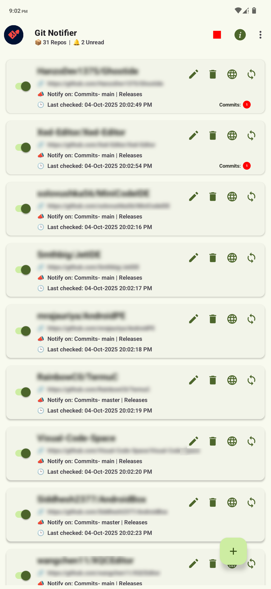
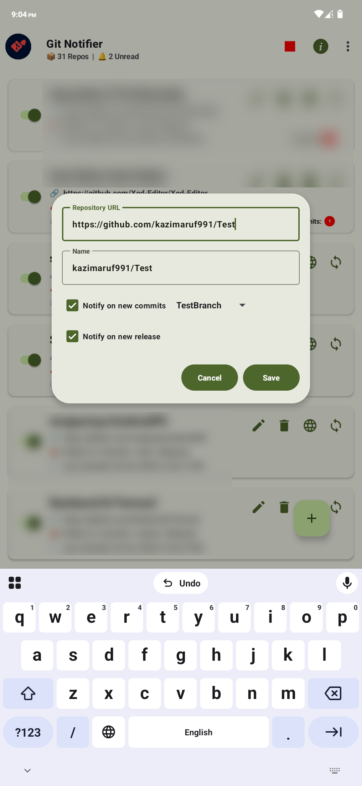
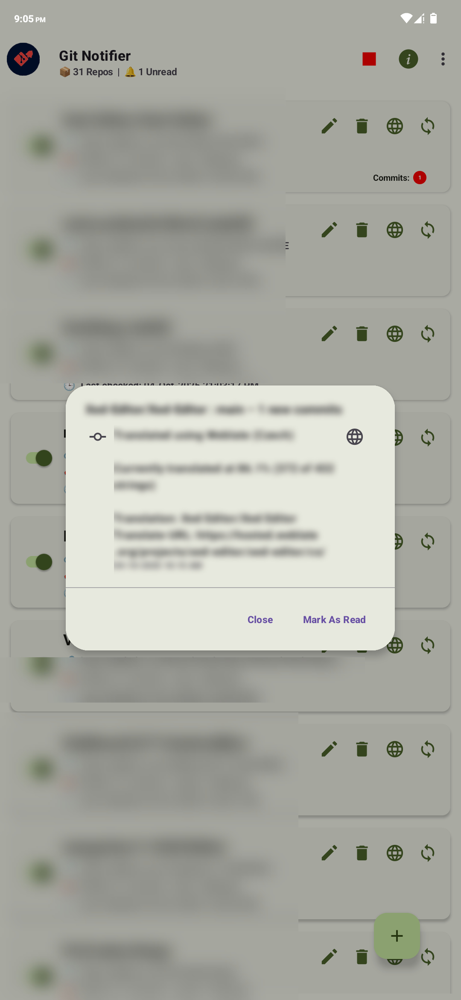
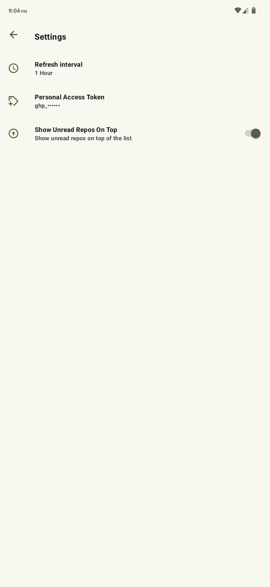

# Git-Notifier

A modern, dynamic Android app to keep you updated on new commits and releases for your favorite git repositories.

---

## 🚀 Features

- **Real-time Notifications**: Get notified about new commits and releases from tracked repositories.
- **Repository Management**: Add, edit, enable/disable, or delete repositories you want to monitor.
- **Unread Tracking**: Instantly see which repositories have unread commits or releases.
- **Background Sync**: Automatic periodic checks for updates, with customizable intervals.
- **Manual Refresh**: Pull to refresh all or force-check individual repositories.
- **Backup & Restore**: Securely backup and restore your app data with password protection.
- **Rate Limit & Auth Status**: View your GitHub API rate limit and authentication state.
- **Settings:**
  	- Set your notification interval and background sync preferences in the app settings.
  	- Add your GitHub personal access token for higher API rate limits (optional).

---

## 📸 Screenshots

  
  
  
  

---

## 🛠️ Getting Started

1. **Visit the Latest Release Page:**  
   👉 [Git Notifier – Latest Release](https://github.com/kazimaruf991/GitNotifier/releases/latest)
2. **Download the APK** from the Assets section.
3. **Install on your Android device:**
	- Enable “Install from unknown sources” in your device settings.
	- Tap the APK to install.
4. **Launch the app**, add a repository, and start receiving Git notifications!

---

## ⭐️ If you like this project, give it a star!
